# 🚀 项目简介 | Project Overview

RAG Knowledge Assistant 系统基于 **Milvus + BGE-M3 + BGE-Reranker-v2-M3 + Qwen2.5** 构建的本地化 Retrieval-Augmented Generation（RAG）知识助手。

项目实现了从文档加载、向量化存储、语义检索、重排序、大模型生成到引用溯源（Citation）的完整 RAG Pipeline，可作为企业知识库问答系统的基础框架。

A local Retrieval-Augmented Generation (RAG) Knowledge Assistant built with:

* Milvus
* BGE-M3
* BGE-Reranker-v2-M3
* Qwen2.5

The project implements a complete RAG pipeline including document ingestion, embedding generation, vector storage, semantic retrieval, reranking, answer generation, and citation tracing.

It can serve as a foundation for enterprise knowledge base Q&A systems.

---

# 🎯 应用场景 | Scenarios

本项目模拟企业知识库问答系统，可应用于：

- 企业文档问答
- 年报分析
- 制度检索
- 知识查询
- AI知识助手

This project simulates an enterprise knowledge base assistant.

Typical use cases include:

- Corporate document Q&A
- Annual report analysis
- Internal policy search
- Knowledge retrieval and summarization
- RAG-based AI assistants

---

# 🎪 项目定位 | Project Positioning

本项目是知识工程路线图中的下游项目。

上游项目：
Unstructured Data Governance

输出：
Governed Knowledge Assets
(JSONL + Metadata + Hash)

当前项目：
RAG Knowledge Assistant

本项目消费治理后的知识资产，
实现企业知识检索、重排序、
答案生成和引用溯源。

This project is the downstream component of the
Knowledge Engineering roadmap.

Upstream Project:
Unstructured Data Governance

Output:
Governed Knowledge Assets
(JSONL + Metadata + Hash)

Current Project:
RAG Knowledge Assistant

The system consumes governance-ready knowledge assets
and provides enterprise knowledge retrieval,
reranking, answer generation, and citation tracing.

# 🏗️ 系统架构  | System Architecture

 

---

# ✨ 项目亮点

* 🔒 **完全本地化部署**（Ollama + Milvus）
* 📄 **支持文档知识库构建**
* 🔍 **BGE-M3 语义检索**
* 🎯 **BGE-Reranker-v2-M3 重排序**
* 🤖 **Qwen2.5 大模型回答生成**
* 📚 **Citation 引用溯源**
* 🌐 **FastAPI REST API 服务化**
* 📖 **Swagger 自动接口文档**


* Fully local deployment
* Vector search powered by Milvus
* BGE-M3 semantic retrieval
* BGE-Reranker-v2-M3 reranking
* Qwen2.5 answer generation
* Citation-based explainability
* FastAPI REST service
* Swagger API documentation

---

# 🛠️ 技术栈 | Technology Stack

| Category           | Technology         |
| ------------------ | ------------------ |
| Language           | Python 3.11        |
| API Framework      | FastAPI            |
| LLM                | Qwen2.5            |
| Embedding Model    | BGE-M3             |
| Reranker           | BGE-Reranker-v2-M3 |
| Vector Database    | Milvus             |
| Model Runtime      | Ollama             |
| Container Runtime  | Docker             |

---

# 🔄 工作流 | RAG Workflow

```text
Governed JSONL
    ↓
JSONL Loader
    ↓
Chunk Objects
    ↓
Embedding (BGE-M3)
    ↓
Milvus Vector Store
    ↓
Semantic Retrieval
    ↓
Reranking (BGE-Reranker-v2-M3)
    ↓
Qwen2.5
    ↓
Answer + Citation
```

---

# 💡 例子 | Example

### Question

```text
2025年归属于上市公司股东的净利润是多少？
```

### Answer

```text
2025年归属于上市公司股东的净利润为
-1,763,294,889.03元。
```

### Citation

```text
[1] 北方华锦化学工业股份有限公司2025年年度报告摘要（第2页）
```

---

# 🌐 API Service

Start service:

```bash
python main.py
```

Swagger UI:

```text
http://127.0.0.1:8000/docs
```

---

## Chat API

### Request

```json
{
  "query": "2025年归属于上市公司股东的净利润是多少？"
}
```

### Response

```json
{
  "answer": "2025年归属于上市公司股东的净利润为-1,763,294,889.03元。",
  "citations": [
    {
      "title": "北方华锦化学工业股份有限公司2025年年度报告摘要",
      "page": 2
    }
  ]
}
```

---

# 🚀 快速开始 | Quick Start

## 1. Clone Repository

```bash
git clone https://github.com/ytt1233/rag_knowledge_assistant.git
```

## 2. Install Dependencies

```bash
pip install -r requirements.txt
```

## 3. Start Milvus

```bash
docker compose up -d
```

## 4. Model Preparation

### Ollama Models

```bash
ollama serve
```
```bash
ollama pull bge-m3
ollama pull qwen2.5:7b
```

### Reranker Model

Download:

```bash
hf download BAAI/bge-reranker-v2-m3 --local-dir D:\models\bge-reranker-v2-m3
```

Or download manually from HuggingFace:

https://huggingface.co/BAAI/bge-reranker-v2-m3

Configure the local model path in:

```python
retriever/reranker.py
```

## 5. Run Application

```bash
python main.py
```

---


# 🗺️ 路线图 | Roadmap

## v1.0.0

* [√] JSONL Document Loading
* [√] Chunk Management
* [√] Embedding Generation
* [√] Milvus Integration
* [√] Semantic Retrieval
* [√] Reranker
* [√] Qwen2.5 Integration
* [√] Citation
* [√] FastAPI Service

## v1.1.0

* [ ] Multi-document Knowledge Base
* [ ] Batch Ingestion Pipeline
* [ ] Collection Management
* [ ] Metadata Filtering

## v1.2.0

* [ ] Deduplicated Knowledge Base
* [ ] Incremental Ingestion Preparation
* [ ] Corpus Quality Monitoring

## v1.3.0

* [ ] Hybrid Search (BM25 + Vector)
* [ ] Metadata-Aware Retrieval
* [ ] Table-Aware Retrieval
* [ ] Retrieval Evaluation

## v1.4.0
* [ ] Incremental Indexing
* [ ] Knowledge Versioning
* [ ] Source Traceability
* [ ] Query Analytics


---

# 📄 License

MIT License
