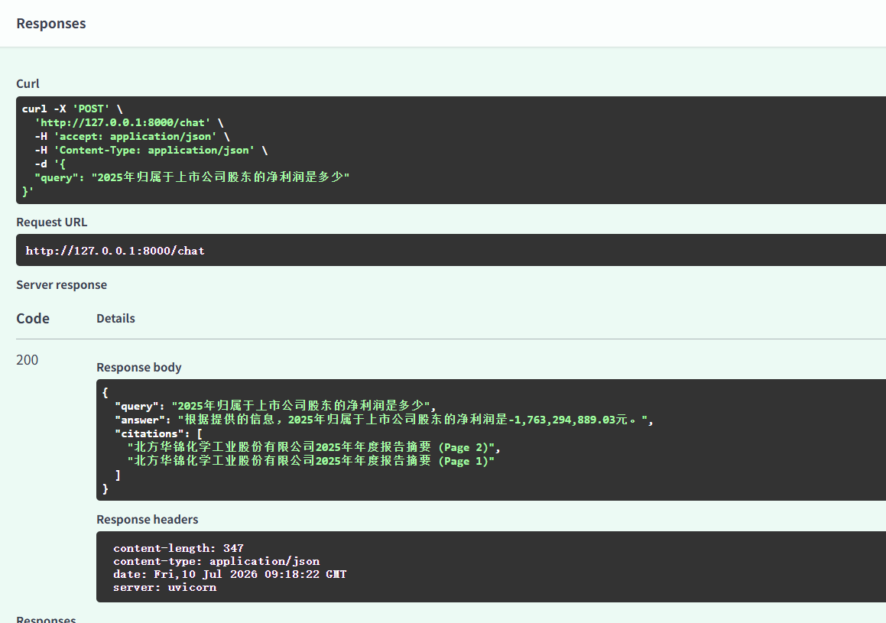

# 🚀 项目简介 | Project Overview

RAG Knowledge Assistant 是系统基于 **Milvus + BGE-M3 + BGE-Reranker-v2-M3 + Qwen2.5** 构建的本地化 Retrieval-Augmented Generation（RAG）知识助手。

该项目实现了完整的RAG流程，包含：

* 治理后语料包加载（Governed Corpus Package）
* 多文档知识库构建
* 知识库管理与持久化
* 批量数据导入流水线
* 文档去重与增量导入准备
* 向量嵌入生成
* 基于Milvus的向量存储
* 语义检索与重排序
* 基于元数据的检索过滤
* 大模型答案生成与引用溯源 


它可作为企业级知识库问答系统的基础框架。

A local Retrieval-Augmented Generation (RAG) Knowledge Assistant built with:

* Milvus
* BGE-M3
* BGE-Reranker-v2-M3
* Qwen2.5

The project implements a complete RAG pipeline including:

* Governed corpus package ingestion
* Multi-document knowledge base construction
* Knowledge base management and persistence
* Batch ingestion pipeline
* Document deduplication and incremental ingestion preparation
* Embedding generation
* Vector storage with Milvus
* Semantic retrieval and reranking
* Metadata-aware retrieval
* Answer generation and citation tracing

It can serve as a foundation for enterprise knowledge base Q&A systems. 

---

# 🎯 应用场景 | Scenarios

本项目模拟企业知识库问答系统，可应用于：

- 企业文档问答
- 年报分析
- 制度检索
- 知识查询
- 企业级 RAG 知识助手

This project simulates an enterprise knowledge base assistant.

Typical use cases include:

- Corporate document Q&A
- Annual report analysis
- Internal policy search
- Knowledge retrieval and summarization
- Enterprise RAG knowledge assistants

---

# 🎪 项目定位 | Project Positioning

本项目是知识工程路线图中的下游项目。

上游项目：
Unstructured Data Governance

输出：
Governed Corpus Package
(JSONL + Metadata + Hash + Governance Report)

当前项目：
RAG Knowledge Assistant

本项目消费治理后的语料包，完成知识库构建、文档去重、向量化存储，并提供企业级
知识检索、重排序、答案生成与引用溯源能力。

This project is the downstream component of the
Knowledge Engineering roadmap.

Upstream Project:
Unstructured Data Governance

Output:
Governed Corpus Package
(JSONL + Metadata + Hash + Governance Report)

Current Project:
RAG Knowledge Assistant

The system consumes governance-ready corpus packages,
builds and manages knowledge bases, performs document
deduplication and vector indexing, and provides
enterprise-grade retrieval, reranking, answer generation,
and citation tracing. 

---

# 🏗️ 系统架构  | System Architecture

 

---

# ✨ 项目亮点 | Highlights

* 📚 知识库管理与持久化 | Knowledge Base Management and Persistence
* 📦 治理后语料包导入 | Governed Corpus Package Ingestion
* 🧹 文档去重与增量导入准备 | Document Deduplication and Incremental Ingestion Preparation
* ⚡ 批量数据导入流水线 | Batch Ingestion Pipeline
* 🔒 完全本地化部署（Ollama + Milvus） | Fully Local RAG Deployment (Ollama + Milvus)
* 🔍 BGE-M3 向量检索 | Vector Retrieval with BGE-M3
* 🏷 元数据过滤检索 | Metadata-aware Retrieval
* 🎯 BGE-Reranker-v2-M3 重排序 | Reranking with BGE-Reranker-v2-M3
* 🤖 Qwen2.5 大模型答案生成 | LLM-based Answer Generation with Qwen2.5
* 📖 引用溯源 | Citation Tracking and Source Attribution
* 🌐 FastAPI REST API 服务 | FastAPI-based RESTful API Service 

---

# 🛠️ 技术栈 | Technology Stack

| Category           | Technology         |
| ------------------ | ------------------ |
| Language           | Python 3.11        |
| Web Framework      | FastAPI            |
| LLM                | Qwen2.5            |
| Embedding Model    | BGE-M3             |
| Reranker           | BGE-Reranker-v2-M3 |
| Vector Database    | Milvus             |
| Model Serving      | Ollama             |
| Container Runtime  | Docker             |

---

# 🔄 工作流 | End-to-End Workflow

### 1、 Ingestion Pipeline（离线） 

```
Governed Corpus Package
        │
        ▼
CorpusLoader
        │
        ▼
KnowledgeBaseManager
        │
        ▼
Deduplication
        │
        ▼
Embedding (BGE-M3)
        │
        ▼
Milvus Vector Store
        │
        ▼
Knowledge Base Update
```

Build and maintain the enterprise knowledge base from governance-ready corpus packages.

### 2、Query Pipeline（在线） 

```
User Query
        │
        ▼
Query Embedding (BGE-M3)
        │
        ▼
Vector Retrieval
        │
        ▼
Metadata Filtering
        │
        ▼
Reranking (BGE-Reranker-v2-M3)
        │
        ▼
Prompt Builder
        │
        ▼
Qwen2.5
        │
        ▼
Answer + Citation
```

Retrieve, rerank, and generate grounded answers with source citations.

---

# 🌐 API Service

Start service:

```bash
python main.py
```

Swagger UI:

```text
http://127.0.0.1:8000/docs
```

## Chat API

### Request

```json
{
  "query": "2025年归属于上市公司股东的净利润是多少？"
}
```

### Response

```json
{
  "query": "2025年归属于上市公司股东的净利润是多少？",
  "answer": "根据提供的信息，2025年归属于上市公司股东的净利润为-1,763,294,889.03元。",
  "citations": [
    "北方华锦化学工业股份有限公司2025年年度报告摘要 (Page 2)",
    "北方华锦化学工业股份有限公司2025年年度报告摘要 (Page 1)"
  ]
}
```

截图如下：




---

# 🚀 快速开始 | Quick Start

## 1. Clone Repository

```bash
git clone https://github.com/ytt1233/rag_knowledge_assistant.git
```

## 2. Install Dependencies

```bash
pip install -r requirements.txt
```

## 3. Start Milvus

```bash
docker compose up -d
```

## 4. Prepare Models

### Ollama Models

```bash
ollama serve
```
```bash
ollama pull bge-m3
ollama pull qwen2.5:7b
```

### Reranker Model

Download:

```bash
hf download BAAI/bge-reranker-v2-m3 --local-dir D:\models\bge-reranker-v2-m3
```

Or download manually from HuggingFace:

https://huggingface.co/BAAI/bge-reranker-v2-m3

Configure the local model path in:

```python
retriever/reranker.py
```
## 5. Prepare Corpus Package

#### Place a governed corpus package into:

data/corpus_packages/

#### Example:

```
data/corpus_packages/

└── package_20260702_143520/
    ├── governed_docs/
    ├── corpus_governance.json
    ├── dataset_report.json
    └── manifest.json 
```

## 6. Build / Update Knowledge Base

#### Run batch ingestion:

```
python -m tests.test_batch_ingestion
```

#### This step will:

• Load the governed corpus package

• Build or load the knowledge base

• Remove duplicated documents

• Generate embeddings with BGE-M3

• Store vectors in Milvus

• Update the knowledge base metadata

## 7. Run Application

```bash
python main.py
```
Open Swagger UI:

http://127.0.0.1:8000/docs

---


# 🗺️ 路线图 | Roadmap

## v1.0.0

* [√] JSONL Document Loading
* [√] Chunk Management
* [√] Embedding Generation
* [√] Milvus Integration
* [√] Semantic Retrieval
* [√] Reranker
* [√] Qwen2.5 Integration
* [√] Citation
* [√] FastAPI Service

## v1.1.0

* [√] Multi-document Knowledge Base
* [√] Batch Ingestion Pipeline
* [√] Collection Management
* [√] Metadata Filtering

## v1.2.0

* [√] Governed Corpus Package Ingestion
* [√] Knowledge Base Management
* [√] Document Deduplication
* [√] Batch Ingestion Pipeline
* [√] Integration Testing

## v1.3.0

* [ ] Incremental Ingestion
* [ ] Hybrid Search (BM25 + Vector)
* [ ] Metadata-Aware Retrieval
* [ ] Table-Aware Retrieval
* [ ] Retrieval Evaluation

## v1.4.0
* [ ] Incremental Indexing
* [ ] Knowledge Versioning
* [ ] Source Traceability
* [ ] Query Analytics


---

# 📄 License

MIT License
